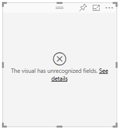
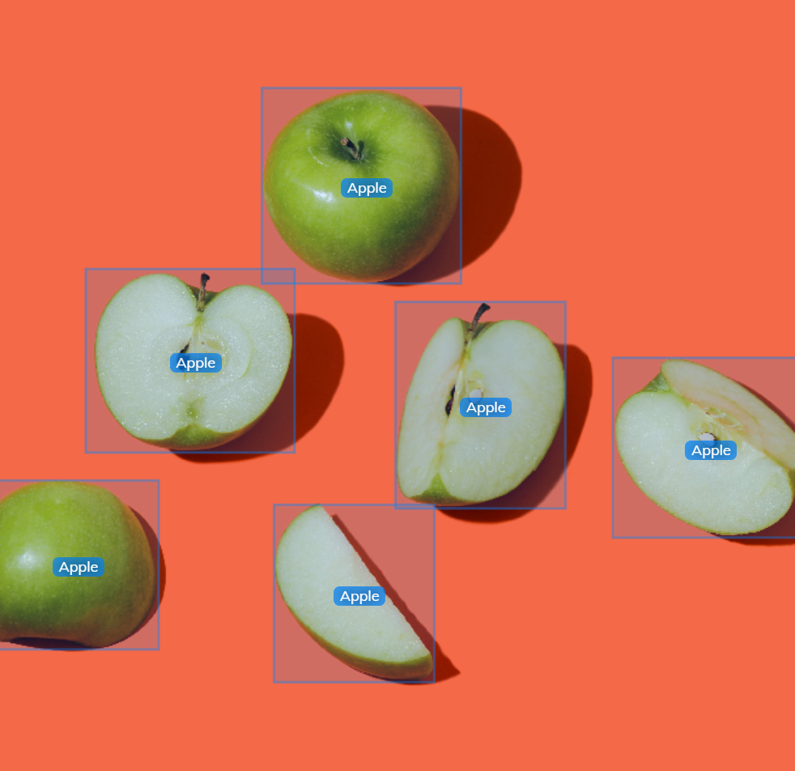
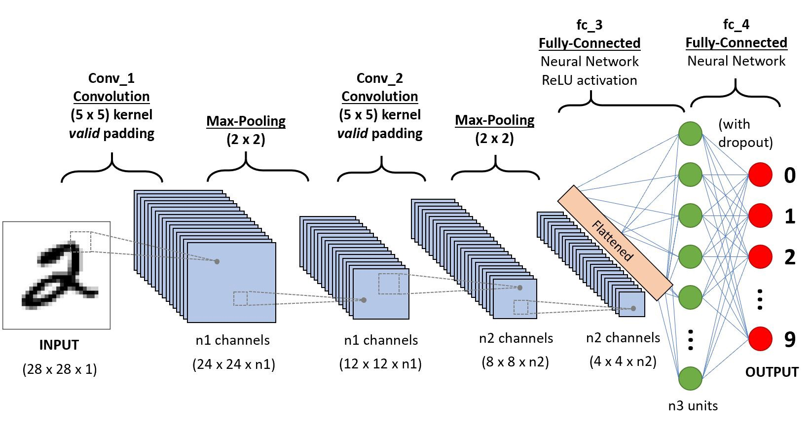
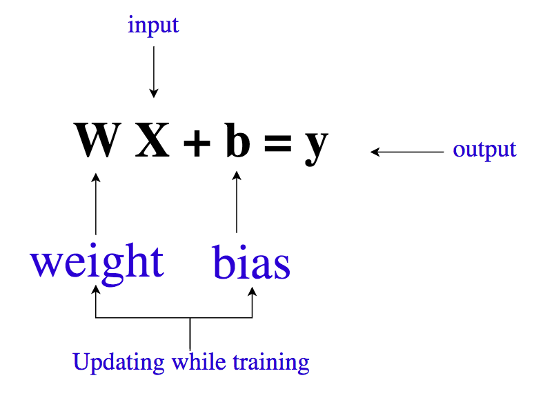
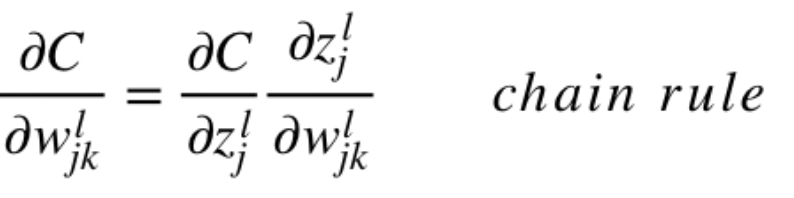
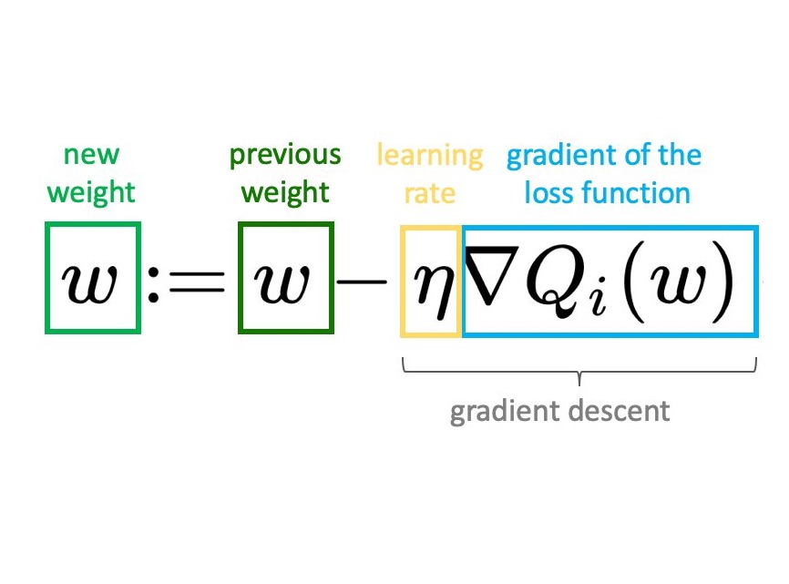
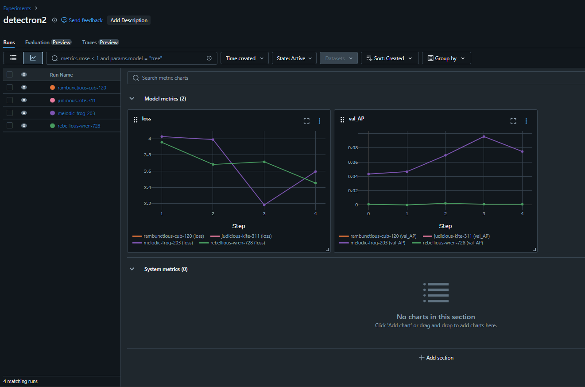
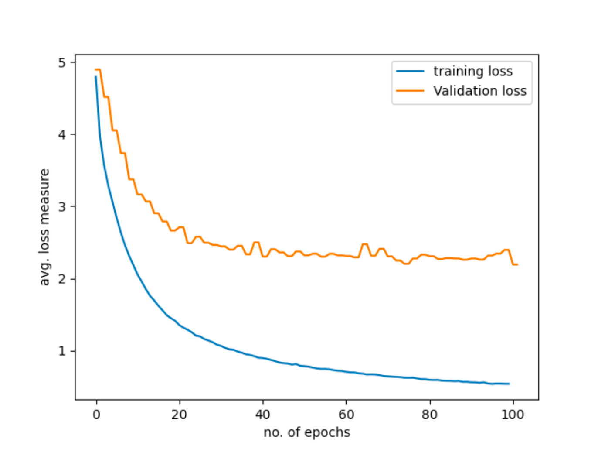
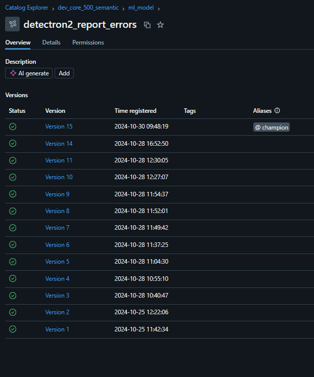
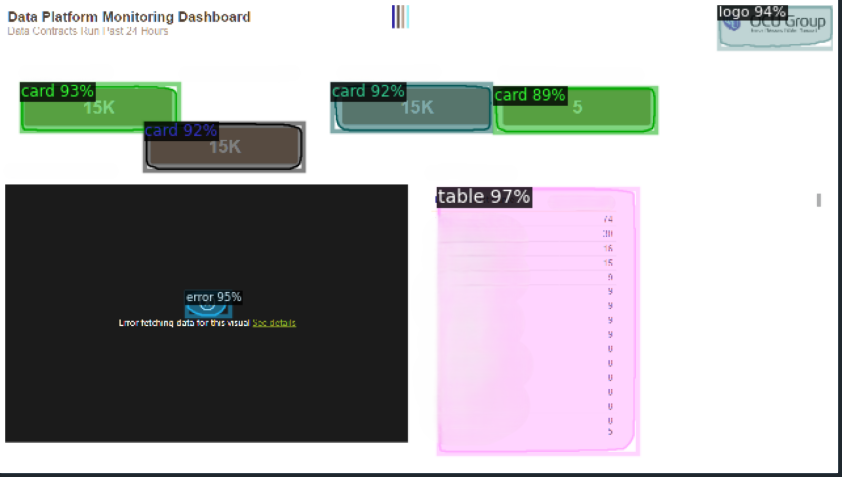

# Impact Evaluation: Detecting errors within PowerBI reports with computer vision models

This impact evaluation reviews a AI/ML project completed recently (October 2024). 
For publishing purposes, and data has been anonymized.

## Overview

### Positive Impact

Since the completion of this project, it has been successfully deployed for use across all our companies reports. 
This deployment has significantly enhanced our teams ability to detect visual errors within reports, and therefore benefits the business by providing error-free reports. 
Prior to this, we as a team only found out about report visual errors via two ways: naturally working with our reports and discovering a visual error or a visual error being reported by one of the report users.
However, with the vision model in place, we can now detect these issues alot easier.

Introducing this model has improved the team's effiency too. As if the model was not in place, then a team member would have to manually go through the reports to discover these visual errors. The benefits have been amplified as of late too, as the number of reports being created by the team has risen sharply. This project has, therefore, led to significant time and resource savings.

### Negative Impact

While the project has achieved positive outcomes, there has been some questions on model accuracy, resulting in the potential of the model missing some visual errors. However I empahsize the word potential, as the probability of this occuring seems very low according to my evaluation on the model.
So in total the negative impacts of this project have been very little.

With some data/AI solutions scalability can be an issue but again as I have utilised databricks and can easily scale out the workload across more machines this will no be an issue. Also the retraining process is as simple as adding more data and re-running a notebook, which is simplier than most ai systems which use models.

So overall, the model just needs to be closely monitored during its early phase where it has just been deployed. After this phase, the model is not monitored as closely but if visual errors are found not be picked up by the model, extensive work should be done to understand why not and come up with an fix (i.e. adding more diverse training data to capture more unique conditions, regularize the model to make sure no overfitting is taking place, etc).

## Conclusion

In conclusion, this AI/ML project has had a significant positive impact on our company's reporting standards and the teams effiency, allowing for increased workloads and better handling of a large amount of business reports. Though, it has been noted that if errors are not picked up by the productionised model then extensive work should be put in place to discover why.

Also the project allows us to answer hypotheses on this topic easier too, for example using this deep learning model I could prove/disapprove hypotheses like: The occurrence of visual errors in Power BI reports is significantly influenced by the complexity of the report design, the volume of data processed, and the frequency of updates to the underlying data sources.

## Ethics, bias, privacy, legal, regulatory obligatons

This is important as I need to make sure I adhere to any legal obligations that may be apparent within this project. Going along the list starting with ethics, this has already been addressed as all data has been anoymized to adhere to company policies on company data. Next, bias. This could be apparent due to the dataset size and the dataset contents. As you will later see a smaller dataset could be used in this instance due to the use of transfer learning, however the dataset contents are of more concern in this project. This is because the images collected for this project were only from a few reports, therefore the data is likely to be somewhat bias. This bias effect can be decreased/solved by increasing the number of reports I collect images for. Lastly for privacy, legal and regulatory obligations, it's in an identicial position to the ethics for this project. This is because all data within this project has been anoymized and all company and data wide policies have been adhered to. 


# Original Documentation

# Contents

- Project Background
- Project Summary
- Neural Network/Process Overview
- A Deeper Dive into the Neural Network Process
- How the process was implemented
- Conclusion
- References

# Project Background

A big part of a data team within a business is to provide insighful reports company wide.

These reports cover a wide range of topics/data and departments/teams use them for insights, performance evaluation and creating new strategies. These reports we offer to the business are considered as products which we deliver and maintain.

The process for building reports is quite lengthy as we try to follow best standards and clear processes when it comes to creating a new dashboard. To quickly outline the process it usually starts with a get together to understand report requirements with the stakeholders, gathering the data, feeding the data through our custom built data pipelines, dimensional modelling (Kimball methodology), creating report measures in DAX and then finally creating the PowerBI report. This project focuses on the latter stage, but probably one of the most important stages too. If there is an visual error on the report, report users are likely to abandon the report very quickly and turn back to other solutions like Excel. Meaning all the hard work which was done previously to get the data into that report, has basically been made pointless. Therefore it is important we are able to identify these visual report errors within PowerBI quickly and get them solved.

For reference the PowerBI visual error symbol looks like a cross and is what we will be focussing on to identify:



To detect these visual errors it could be taken away as a manual task to do everytime we release an update to our reports, however like I have already mentioned this would make the team more ineffiecent. Also with the increasing number of reports which we have created and now maintain, this manual task would keep getting more inefficient as time went. 

Therefore the automatic system we wanted to put in place was a neural network, like a convulitonal or recurrent neural network (CNN/RNN respectively), which could identify objects. Then with this model I would use transfer learning to modify a specific set of weights to make the model more specific to our use case and data. This model should then be able to identify objects like PowerBI visual errors, graphs, tables and so on. The productionisation of this model would also be a big factor, as the model would need to be easily accessible so that inference (prediction) would be easy. There are several possible ways to do this, but as our current data solution already uses unity catalog within databricks to manage the data at its different stages in the pipeline, I felt it would be best to store the model in unity catalog. This will be discussed more later on.

So overall as reports are one of the most important products we offer as the data team, using AI/ML to ensure their consistency and standards are maintained, was a good use of machine learning.

# Project Summary

## Issue at Hand

Identifying visual errors within PowerBI reports as they can quickly put end users off the reports. It isn't sensible to do this as a manual task with the growing number of reports.

## Solution

Use a neural network like a CNN to pick up these PowerBI visual errors.

## Outcome

A pre-trained neural network was utilized and transfer learning was carried out to make the model more specific to our objects. In the end, I had an accurate model which was easily accessible and could identify errors within PowerBI.

# Neural Network/Process Overview

## A High Level Look at the Neural Network/Process

A lifecycle approach will be taken to integrate this AI model. Models, like CNN's, need data to be trained on so that their weights within the model can optimized. Therefore, data quality and preparation is key. Depending on what ML model you are using, the required input format for the data can vary significantly. The CNN I am using takes data in various formats, but prefers the COCO dataset style. Once in the required format, the data can be passed into the neural network, where the model will then be trained. After training, I can then use the model for inference on new images to detect objects like the error symbol.

From interaction within the data science community, the detectron2 library of models provided by Facebook, was highly recommended for all computer vision tasks. After doing some of my own research about detectron2, I discovered it offered a pre-trained object detection model, that had different variations (the same model but with just more layers), and also offered the oppurtunity of transfer learning the model onto a custom dataset.

After this model had been trained, tested and was ready for production, the model would be made live through Unity Catalog. Unity Catalog is a unified data governance solution provided by Databricks and is something the team is already using for managing its data assets.

In the next section I'll talk about this whole process in a bit more depth.

## A Deeper Dive Into the Neural Network/Process

### Data Prepartion

As already mentioned, the CNN that I would be using for this task required the data to be in a COCO (Common Objects in Context) dataset format. This format is a json file, but is widely used for computer vision tasks (especially object detection). This is because this format stores the different object names, and annotations for each image. Annotations are basically boxes around the different objects which highlights the object and its name. Below is a quick generic example of what these annotations sections look like within the json file.

```python

"annotations": [
    {
      "id": 1,
      "image_id": 1,
      "category_id": 1,
      "bbox": [100, 200, 50, 50],
      "segmentation": [[100, 200, 150, 200, 150, 250, 100, 250]],
      "area": 2500,
      "iscrowd": 0
    }
  ]
```

This was the first challenge for me as we did not yet have any pictures, let alone the annotations. Therefore the first job was to capture around 100 images of the different reports we had currently, and annotate each of them. A tool called labelme was used for this, and this helped in drawing the bounding boxes around the objects I wanted to capture, label these boxes with their different object names, and lastly export these images and annotations into a COCO format. Below is a picture of essentially what annotations look like visually within a image.



To note: variation of the images used in training any visual model is an important factor, and that is why techniques like augmentation exist which adds this variation for you. This technique can flip images, change colours, add bluriness just to name a few things. Augmentation was something that the CNN within detectron2 already did, so wasn't something I needed to worry about in this project.

The final stage of the data preparation section is to register the dataset with detectron2. This isn't like registering an account etc, but more telling detectron2 how to access your dataset so that it can be used for training and validation. This was accomplished with the following code, in databricks:

```python
from detectron2.data.datasets import register_coco_instances
register_coco_instances("my_dataset_train", {}, "/Volumes/dev_core_100_landing/_volumes/root/ml-testing/powerbi-report-error-detection/train/annotations/train.json", "/Volumes/dev_core_100_landing/_volumes/root/ml-testing/powerbi-report-error-detection/train/images")

register_coco_instances("my_dataset_val", {}, "/Volumes/dev_core_100_landing/_volumes/root/ml-testing/powerbi-report-error-detection/train/annotations/val.json", "/Volumes/dev_core_100_landing/_volumes/root/ml-testing/powerbi-report-error-detection/train/images")
```

The code above registers the COCO datasets with detectron2. The register_coco_instances function takes in the following as parameters: the dataset name, COCO dataset json file path, the file path to the images.

Now that the train and validation datasets had been registered with detectron2 I will now talk about the Neural Network model in a bit more depth.

### The CNN model

The convolutional neural network were first introduced in the late 1980s and early 1990s. It was heavily inspired by the human visual system in the way that the visual cortex processes visual information. The main ideas applied to this model were extracting relatively simple features first from an image, like lines etc, to then building on these feautres and extrating more complex features like shapes i.e. a person's face. Below is an diagram of what the CNN's architecture usually looks like:



To stick to the key processes within that image, we can see that there is a small grey dotted-line box within each layer. This box is called a kernel (or filter) and is used within each layer of the network to detect the features (like the edges, textures, patterns). This kernel slides over the images and produces feature maps that contain the information of the features within the image. Feature maps are usually passed into the next layer so that they can be filtered by a kernel again to extract more complex feautres (O'Shea and Nash, 2015).

The pooling layers you can see are there are to reduce the spaital dimensions (height and width) of the feature maps. This prevents the model from overfitting on the training data, and to also improve computational effiency as there is less data to process.

One of the last layers that hasn't been mentioned is the fully connected (fc) layer. This layer is more generic and can be seen across most neural networks. This layer has a neuron for each feature passed into it, and the feature is multiplied by a weight with a bias term added too. The mathematical equation for this usually looks something like this:



Then lastly the output layer. As an example, this layer usually has as many neurons as there are classes in a classifcation task i.e. zebra, dog, cat; there would be 3 neurons. Then within each of these neurons they hold the probability of the image belonging to that class. In our case, for example it could be 0.2 (20%) for graph, 0.01 for table, 0.7 for error and 0.09 for title.

Those are the key components within the CNN diagram. I will now quickly talk about how this model would usually work during training.

So an image would be passed into the model, and to start off with all feature map values, weight matrices and bias terms would be initialized with random values (however usually 0 to speed up training). The image would be put through each layer with the respective actions and calculations taking place, that have already been mentioned. This is called a forward pass.

To then calculate how well this model has done at predicting the objects within the image, the loss of the model is calculated. This is done by using a loss function (i.e. cross-entropy loss is usually used for classification) which measures how far the networks predictions are from the actual labels.

After the loss has then been calculated, it is used in a backward pass of the model (backpropagation). This is where partial derivatives and the chain rule come into play. The chain rule is then used to calculate the partial derivatives (gradient) of the loss with respect to each of the weights within each layer. Below is an equation of this process:



The output here is the gradients for each weight, which indicates how much each weight contributed to the total error (Rumelhart, Hinton and Williams, 1986).

The last stage is to use a optimization algorithm like Stochastic Gradient Descent (SGD), to update the weights using the gradients of each weight we just calculated. The equation for this process is below:



The gradients of the weights are being multiplied by a learning rate (a hyperparameter) and the result is subtracted from the weight to get the new weight. To quickly mention, picking a good learning rate is highly important. In simple terms, it determines how quickly the learning process will take to reach the best weight value. I like the picture below because I think it desribes the process of what gradient descent is trying to do clearly, along with showing the importance of the learning rate.


Note that if the algorithim finds the best weight value, the gradient will be 0. If we refer back to the gradient descent equation, we can see that if the gradient of the weight is 0, then nothing will be subtracted away from the optimal weight. However sometimes reaching the optimal weight values isn't feasible or sensible, therefore a maximum number of iterations or/and a smallest step value limit is usually implemented to stop the learning process as we can settle for a very nearly optimized solution.

This goes over the important concepts and the training process of the CNN model.

### Model Storing and Accessibility

After the model had been trained and was performing well at identifying objects within reports, the next stage is to store that newly trained model and it's weights whilst making sure it is easily accessible for future predictions. This is important as if the model is not accessible then how are we meant to use this model as part of our processes.

Therefore I looked at storing the model within Unity Catalog. The benefits of storing the model in UC are many, for example the model is accessible by any of the team with simple calls to it by just using the models file path. Also as the models are registered into Unity Catalog with MLflow, model versioning is handled for you.

For reference, MLflow is a tool used for managing the machine learning lifecycle and is integrated directly into databricks. It offers handy features like experimentation tracking, model management and deployment.

To continue, whenever someone re-trains the CNN object detection model, MLflow realizes that there is already a current model version and therefore adds a new version into UC. This opens the door to comparing models' performances. For instance if there are two versions of a model, I could load the different versions and get performance metrics from both on a test set. From here, I would have the information required to understand which model performed better and which one I should use going forward in production.

# How the process was implemented

## Implementing this into databricks

Now that the process and inner workings have been discussed, I will talk about how this process was actually implemented within databricks. I have already mentioned how the datasets were registered with detectron2 so I will skip over this part, but I will begin at the model training process.

As I planned to store the model in unity catalog I first configured MLflow to use Unity Catalog for model registry operations.

```python
import mlflow
mlflow.set_registry_uri("databricks-uc")

MODEL_NAME = "dev_core_500_semantic.ml_model.detectron2_report_errors"
```

The MODEL_NAME is also an important variable here. This variable will be used without as it tells databricks where I want to store my model and in future what model I want to use. Unity Catalog uses catalogs, schemas and lots of other things and you can read the MODEL_NAME file path as `catalog.schema.model_name`.

The next step was to train the model. MLflow is helpful for experimentation tracking during training, therefore I thought it'd be a waste not to use some of those capabilites here. So I added the following code in to log the loss and validation loss. The detectron2 library is setup so that classes are used for training (DefaultTrainer). So to log loss you have to create your own hook classes that inherit of the HookBase class. The key parts to look at in the code below are the `mlflow.log_metric("loss", total_loss, step=iteration)` and `mlflow.log_metric("val_AP", val_ap, step=iteration)`. These both log the loss and validation average precision respectively, to the MLflow experimentation run.

```python
class MLflowLoggerHook(HookBase);
    def __init__(self):
        super().__init__()

    def after_step(self):
        loss_dict = self.trainer.storage.latest()
        total_loss = loss_dict["total_loss"]
        total_loss = total_loss[0]
        iteration = self.trainer.iter
        if iteration > 0:
            mlflow.log_metric("loss", total_loss, step-iteration)

class ValidationLossHook(HookBase):
    def __init__(self, cfg):
        super().__init__()
        self.cfg = cfg

    def after_step(self):
        if self.trainer.iter % self.trainer.cfg.TEST.EVAL_PERIOD == 0:
            evaluator = COCOEvaluator("my_dataset_val", self.cfg, False, output_dir="./output/")
            val_loader = build_detection_test_loader(self.cfg, "my_dataset_val")
            results = inference_on_dataset(self.trainer.model, val_loader, evaluator)
            print(f"RESULTS IS THE FOLLOWING: {results}")

            bbox_metrics = results["bbox"]
            val_ap = bbox_metrics["AP"]
            mlflow.log_metrics("val_AP", val_ap, step=self.trainer.iter)
```

For the actually training part, databricks offers some nice functions like `mlflow.pytorch.log_model(` & `mlflow.pytorch.log_model(`, which stores the model in MLflow. But in my case I will be using this function to store the model in Unity Catalog. For example:

```python
    mlflow.tensorflow.log_model(
        model,
        artifact_path="model",
        input_example=example_input,
        registered_model_name=MODEL_NAME
    )
```

In the code above the MODEL_NAME, which is dev_core_500_semantic.ml_model.detectron2_report_errors, tells MLflow to store the model in Unity Catalog. So this is one of the more important functions in the training process.

To look at the whole initial training code in one go, I will provide it below:

```python
def train_and_register_detectron2_model():
    # starting a run in the experiment
    with mlflow.start_run() as run:
        print(f"Started run: {run.info.run_id}")

        # detectron2 model configuration
        cfg = get_cfg()
        cfg.merge_from_file(model_zoo.get_config_file("COCO-InstanceSegmentation/mask_rcnn_R_50_FPN_3x.yaml")) # the backbone model
        cfg.DATASETS.TRAIN = ("my_dataset_train",)
        cfg.DATASETS.TEST = ("my_dataset_val",)
        cfg.DATALOADER.NUM_WORKERS = 2
        cfg.MODEL.WEIGHTS = model_zoo.get_checkpoint_url("COCO-InstanceSegmentation/mask_rcnn_R_50_FPN_3x.yaml") # weights I am loading into the model
        cfg.SOLVER.IMS_PER_BATCH = 2  
        cfg.SOLVER.BASE_LR = 0.00025  # important for the optimization algorithm
        cfg.SOLVER.MAX_ITER = 300  # important for where you want the model to 
        cfg.SOLVER.STEPS = []
        cfg.MODEL.ROI_HEADS.BATCH_SIZE_PER_IMAGE = 128   
        cfg.MODEL.ROI_HEADS.NUM_CLASSES = 5  
        cfg.MODEL.DEVICE = "cpu"
        cfg.TEST.EVAL_PERIOD = 50 # Set this high to speed up training

        os.makedirs(cfg.OUTPUT_DIR, exist_ok=True)
        trainer = DefaultTrainer(cfg) 
        trainer.register_hooks([MLflowLoggerHook(), ValidationLossHook(cfg)])
        trainer.resume_or_load(resume=False)
        trainer.train()

        model_state_dict = torch.load(os.path.join(cfg.OUTPUT_DIR, "model_final.pth"))
        model = trainer.model # LOADING MODEL

        model.eval() # SETTING MODEL TO EVALUATION MODE SO OUTPUT CAN BE USED IN SIGNATURE

        example_input = torch.randn(3, 224, 224)
        example_input_dict = [{"image": example_input}] # INPUT TO DETECTRON IS DICT DATA TYPE: "image": {image_data}
        example_output = model(example_input_dict)

        signature = infer_signature(example_input.numpy(), example_output[0]["instances"].get_fields()["pred_boxes"].tensor.detach().numpy()) # ALL MODELS IN UC NEED TO HAVE A SIGNATURE

        model_path = os.path.join(cfg.OUTPUT_DIR, "model_final.pth")

        mlflow.pytorch.log_model(
            pytorch_model=trainer.model,
            artifact_path="model",
            signature=signature,
            registered_model_name=MODEL_NAME
        )
        print("Model logged to MLflow")
    
    return model

train_and_register_detectron2_model()
```

The first important line in the preceding code is: `with mlflow.start_run() as run:`. This is important as it creates a new run within the experiment, and allows for metrics to be logged etc. All the cfg elements below this line belong directly to the detectron2 library. Here, `cfg.merge_from_file(model_zoo.get_config_file("COCO-InstanceSegmentation/mask_rcnn_R_50_FPN_3x.yaml"))` I'm loading the backbone of the model, and this saves a lot of time when it comes to setting up the model architecture and how a image will actually move through the network. To note RCNN stands for: Region-based Convolutional Neural Network. The next important line is: `cfg.MODEL.WEIGHTS = model_zoo.get_checkpoint_url("COCO-InstanceSegmentation/mask_rcnn_R_50_FPN_3x.yaml")`. This is important as it loads the weights for the model backbone I just loaded, and these weights come from the pre-trained model. This again saves us a lot of time and compute, because to obtain these weights I would have to train the model on a set of very powerful GPUs, for a very long time. This is where transfer learning shines as I can now just use these weights from the pre-trained model, and just change a few to make model more specific to my object detection task. The next important lines are hyperparameters. Hyperparameters are model settings that are set by the machine learning practioner and are not optimized by the model during the training process. The first hyperparameter is the learning rate, `cfg.SOLVER.BASE_LR`, which I have already mentioned in the gradient descent algorithm therefore I will not repeat the importance of it. The value of 0.00025 for the LR, is the default the detectron2 recommends. The next hyperparameter is the maximum number of iterations: `cfg.SOLVER.MAX_ITER = 300`. This limits the model on how many epochs (runs through the data) the model can do. This can help massively in situations where your model starts to overfit your training data or where your model has already converged (stabilized) but is still trying to find the best, most optimal weights possible which isn't feasible or sensible. The code lines after these are just for kicking the training off and setting up the details required for the model to be able to be stored within Unity Catalog.


## Evaluating the model outputs

In the preceding section, I talked about how the model was trained. Here in this section I will talk about how the model was evaluated and used in for prediction (inference). So after a model has finished training its run is logged into the experiment is was apart of, within the MLflow section in databricks. This looks like the following:



Here you can see the different metrics in a line graph plotted against the number of epochs the model was trained for. The colours also represent the different runs. Being able to see these metrics visually and being able to compare the different runs like this, makes life as a machine learning practioner alot easier. I would say to add on this it would be good to be able to see the metrics for one run, on just one graph. I say this because this would then represent a learning curve graph, which is very useful for evaluating whether a model converged during training and whether it overfitted the training data. For example this is what I could plot to show this information for one run:



In the above graph we can see that the model likely converged during training. This means that if I was to continue training the model not a lot of benefit would be seen in terms of error decreased. However it also shows that the model heavily overfit the training data. This is because as the error kept decreasing on the training data, it did not for the validation data. This means that the model started to overfit to the training data. With this model we would expect to get a really low performance scores a test set, due to it's poor generalization (high variance) that has been created during training. But models can not only overfit, but also underfit which is sometimes known as high bias. Underfitting is where the model is not able to really learn anything from the training data that will help it to make accurate predictions on unseen data. It should be noted here that you cannot have a model with really low bias and really low variance as they both have contradicatory objectives. One is trying to get really accurate predictions on the training data (leading it to overfit to the training data), and the other is trying to make the model more generalizable (leading it to underfit to the training data). This balance and trade-off between the two is formally known as the bias-variance tradeoff.

The next important output of the training process, is the storing of the model within Unity Catalog. In the picture below we can see how when the training process is rerun, MLflow just adds another verion to that model.



This will allow for comparisons of different versions of the same model in the future, whereby we are trying to improve the current model.

## Using the model for inference

As the model has been trained and it's training performance evaluated I can make predictions on unseen images of reports. This will also allow for testing to see how the model performs when it comes to making predictions on unseen data.

There are several ways to load the newly trained model with either Unity Catalog or directly from the experiment run. In this write-up I will just load the model directly from the artifacts section within the experiment run. This arifacts section holds all the data required to set up the model within any environment, but I am just interested in loading the models pytorch file that has the file type of `.pth`.

```python

# reinstializing cfg, as inference may be done seperately
cfg = get_cfg()
cfg.merge_from_file(model_zoo.get_config_file("COCO-InstanceSegmentation/mask_rcnn_R_50_FPN_3x.yaml"))
cfg.DATASETS.TRAIN = ("my_dataset_train",)
cfg.DATASETS.TEST = ()
cfg.DATALOADER.NUM_WORKERS = 2
cfg.MODEL.WEIGHTS = model_zoo.get_checkpoint_url("COCO-InstanceSegmentation/mask_rcnn_R_50_FPN_3x.yaml")
cfg.SOLVER.IMS_PER_BATCH = 2
cfg.SOLVER.BASE_LR = 0.00025
cfg.SOLVER.MAX_ITER = 300
cfg.SOLVER.STEPS = [] 
cfg.MODEL.ROI_HEADS.BATCH_SIZE_PER_IMAGE = 128
cfg.MODEL.ROI_HEADS.NUM_CLASSES = 5
cfg.MODEL.DEVICE = "cpu"

cfg.MODEL.WEIGHTS = os.path.join(cfg.OUTPUT_DIR, "/output/model_final.pth")  # path to the model we just trained
cfg.MODEL.ROI_HEADS.SCORE_THRESH_TEST = 0.7   # set a custom testing threshold
predictor = DefaultPredictor(cfg)
```

The main takeaways from the above code are the reinitilization of the cfg object, the loading of the model weights and setting a custom threshold. The cfg object is reinitialized with the same model backbone here as this cell maybe be run independently within this notebook therefore I want to make sure no errors appear due to no initialization of the cfg object. The setting of the model weights is also important as these weights contain some which have been opitimized during the training process for this specific object detection task. The weights are all stored within the .pth file. Lastly, the setting of the custom threshold is important as if there was no threshold then we would see a lot more preditions of where the model thought objects would be within the image. However these predictions would have a small probability of being true, therefore I just want to focus on the predictions which the model is pretty confident in. That is why the threshold is set to 70%.

Next I loaded in the first image to carry out predictions on and this was done like so:

```python
image_path = "/Workspace/Users/tt/workspace-data/02.png"
image = cv2.imread(image_path)
```

Then the predictions were carried out with `outputs = predictor(image)`. To now visualize these predictions so it is easier to make sense of them, I did the following:

```python
v = Visualizer(image[:, :, ::-1], metadata=MetadataCatalog.get("my_dataset_train"), scale=0.5)
out = v.draw_instance_predictions(outputs["instances"].to("cpu"))
output_image = out.get_image()[:, :, ::-1]

plt.figure(figsize=(20, 20))
plt.imshow(output_image)
plt.axis('off')
plt.show()
```

And the output of this was the following:



We can see that the model pickups all the objects we wanted to pick up. It predicted a probability of 95% that the error symbol was an error symbol, 94% for the logo, low 90%'s for the cards and then 97% for the table. For your information some of the data on this report and within the table has been removed with an AI eraser, therefore before the erasing there were quite a lot of features which made it obvious the table was an table. Overall, these are promising results and we further test this model by using it other images of reports it has not yet seen, but also using metrics like mAP (mean average precision).

Mean Average Precision (mAP) is a good metric to use to evaluate object detection models as it combines precision and recall to provide a single score. To recap, precision is the ratio of true positive predictions to the total number of detections and it's purpose is to measure how many of the detected objects are actually correct. And the recall is the ratio of the true positive detections to the total number of actual objects with a purpose to show how many actual objects were detected. The average precision is calculated for each class by plotting the precision-recall curve and computing the area under the curve (AUC) which results in a single value summarizing the precision-recall trade-off for that class. Lastly, the mean average precision is the mean of the average precision values for all classses. So it provides an overall measure of the model's performance across all classes.

Evaluating the mean average precision score is context driven, and in this case the model achieve a mAP of 0.9 (90%). This is a good score, and is good enough for this model to be incorporated into the data teams workflow.

# Conclusion

## Outline

The creation of this model was an exercise in applying the key foundations of any data system or machine learning system, autonomy. Without this model, a task which could be autonomised is now manual, meaning develops on the data team have less free time to create and improve heir current products in which they offer.

Having a model which is served up within databricks and is easily accessible allows development processes to be coded that take advantage of this.

Knowing the underlying architectutre of various poopular CV (computer vision) models & reading developer documentation on specific packages like detectron2 allowed me to know what to expect in terms of quality of models predictions, how much data is required for good performance but also some of the limitations/difficulities of these neural networks like vanishing gradients etc.

Validation was done within and after training. During training validation highlighted any overfitting or underfitting, and after training helped with an assessment of the quality of the models predictions.

Unity Catalog was the chosen place where the model would be stored and accessed with model serving. The model is accessible to all data team members for inference, and storing/serving the model in UC stopped the bad developer pratice of passing around model files to load the model for each developer seperately.

## Considerations

As more reports get added, the input data to this model may shift. This is a common problem in ML for production however if MLOps has been done well, then a simple retrain with new data (i.e. pictures of reports now in Tableau, PowerBI Mobile etc) would suffice to fix this problem. 

Future work on containerization of the model and it's repsective dependenicies is defintely considered, to bring the model outside of the databricks environment and into other services like Azure etc. Deploying this model to edge devices like mobiles is also a possible task in the future.

Some other things like hyperparameter optimization and training dataset size evaluation could also be completed. Learning curves could be plotted for different training dataset sizes to see how dataset size impacts the model when learning. Also using packages like Optuna I would be able to optimize a few of the hyperparamets like the learning rate, maximum number of iterations, batch size and so on.

#  References

O'Shea, K. and Nash, R. (2015). An Introduction to Convolutional Neural Networks.
Rumelhart, D.E., Hinton, G.E. and Williams, R.J. (1986). Learning representations by back-propagating errors.
